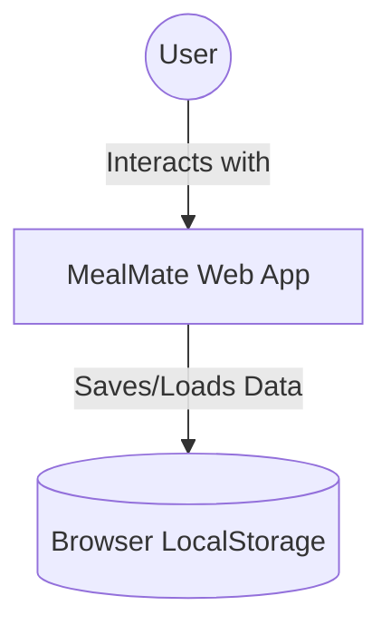
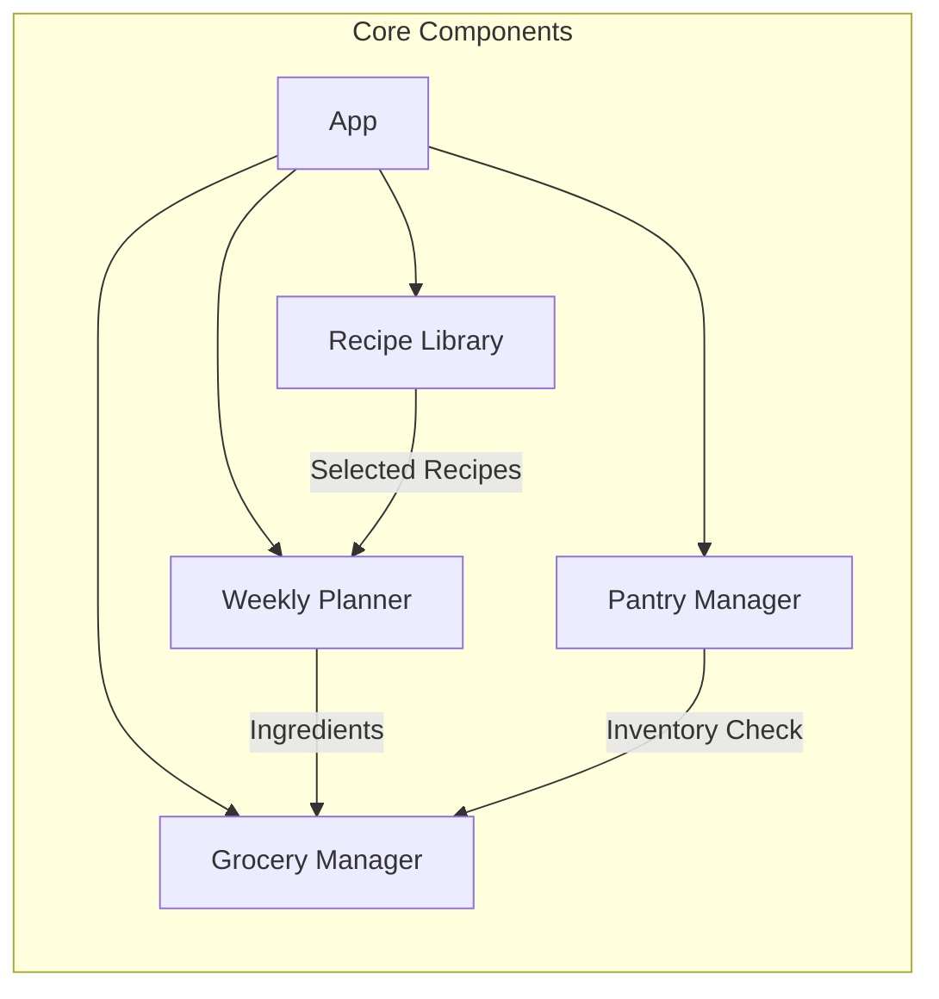
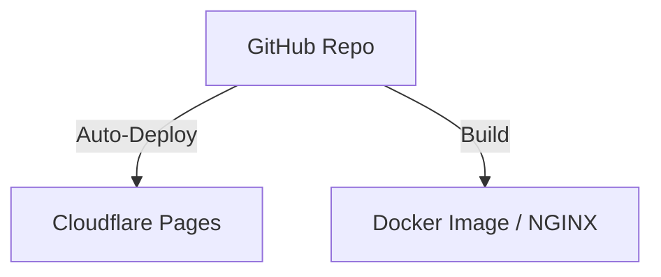

# Architecture Documentation: MealMate

## 1. System Context
MealMate is a client-side web application designed to run in modern browsers. It interacts with the user's LocalStorage for data persistence, ensuring a high-performance experience without the latency of a backend database for the Phase 2 requirements.

## 2. Building-Block Decomposition
The application is structured using a component-based architecture (React):

- **Main Application**: Manages global state and routing.
- **Recipe Library**: Fetches and filters recipes from a static JSON database.
- **Weekly Planner**: Handles the drag-and-drop/assignment logic and persists the weekly schedule.
- **Grocery & Pantry**: Logic-heavy components for aggregating ingredients and subtracting existing inventory.

## 3. Technology & Tool Choices
| Technology | Rationale |
| :--- | :--- |
| **React 18** | Industry-standard declarative UI library with a powerful ecosystem. |
| **Vite 5** | Provides an extremely fast development server and optimized production builds. |
| **Vanilla CSS** | Maximum control over performance and aesthetics without the overhead of heavy CSS-in-JS libraries. |
| **Vitest** | Fast, lightweight testing framework compatible with Vite. |

## 4. Deployment View
The system is containerized for consistent behavior across environments.

- **Development**: Managed via `docker-compose.dev.yml` for rapid prototyping.
- **Production**:
    - **Docker**: NGINX serves the static assets built by Vite.
    - **Cloudflare Pages**: Automated CI/CD pipeline triggered on GitHub pushes. Cloudflare Pages is used for static hosting of the Vite build output (dist) because it is lightweight and suitable for an MVP web application.

