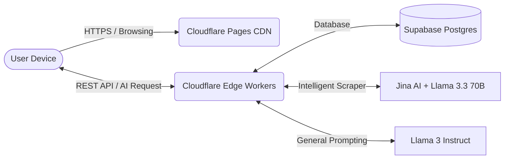
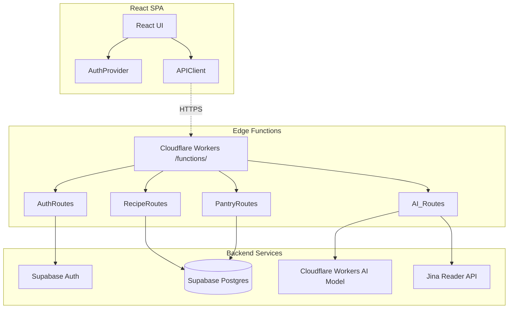

# Architecture Documentation: MealMate

## 1. System Context
MealMate is a globally-distributed web application designed for meal planning, intelligent web scraping, and community recipe-sharing. It follows a serverless Edge processing structure, leveraging Supabase as the core persistence unit.

```mermaid
graph LR
    User([User Device]) -->|HTTPS / Browsing| CP(Cloudflare Pages CDN)
    User <-->|REST API / AI Request| Edge(Cloudflare Edge Workers)
    Edge <-->|Database| Supabase[(Supabase Postgres)]
    Edge <-->|Intelligent Scraper| JinaAI[Jina AI + Llama 3.3 70B]
    Edge <-->|General Prompting| LlamaAI[Llama 3 Instruct]
```

## 2. Building-Block Decomposition
The system is decomposed safely into highly decoupled layers bridging Edge workers to standard endpoints:

### Frontend (Browser)
- **UI Components**: React components for Community, Recipe Library, AI Modals, Planner, and Pantry.
- **Domain Logic**: Client-side logic for ingredient scaling, budget tracking, UI caching, and list aggregation.
- **State Logic**: A custom Animated Global Dialog manager explicitly intercepts native popup blockers and intercepts global UI commands securely.

### Edge Backend (Cloudflare API Routes)
- **Route Layer**: `/functions` execute standard requests closer to the end-users.
- **Jina & Extractor Routes**: Specially provisioned endpoints handling large JSON mappings and executing `workers-ai`.
- **Database Client**: Leverages standard `@supabase/supabase-js`.

```mermaid
graph TD
    subgraph Frontend [React SPA]
        UI[React UI] --> AuthProvider
        UI --> APIClient
    end
    
    subgraph Edge Functions
        APIClient -.-> |HTTPS| EdgeAPI
        EdgeAPI[Cloudflare Workers /functions/]
        EdgeAPI --> AuthRoutes
        EdgeAPI --> RecipeRoutes
        EdgeAPI --> AI_Routes
        EdgeAPI --> PantryRoutes
    end
    
    subgraph Backend Services
        AuthRoutes --> SAuth[Supabase Auth]
        RecipeRoutes --> SDB[(Supabase Postgres)]
        PantryRoutes --> SDB
        AI_Routes --> CFWorkersAI[Cloudflare Workers AI Model]
        AI_Routes --> Jina[Jina Reader API]
    end
```

## 3. Persistence Strategy
- **Primary Source of Truth**: All core functionality (Recipes, Community, Authors, Ingredients mapped entities, Pantries) lies on the globally hosted **Supabase PostgreSQL instance**.
- **Security Protocols**: Role-Level-Security (RLS) is forcefully dictated at the database core table logic itself, negating extensive Node.JS security middleware checks locally. 

## 4. Deployment View
The legacy Docker methodology was intentionally phased out during Phase II to prioritize instant scalability and lowest TCO via Cloudflare.

```mermaid
graph TD
    subgraph GitHub
        Code[Source Repository]
    end

    Code -->|Push to Main| CI[Cloudflare Pages CI/CD]

    subgraph CDN [Cloudflare Edge Network]
        CI --> WebAsset[Static HTML/JS Assets]
        CI --> CFWorkers[Serverless /api/ Functions]
    end

    User🌐 --> WebAsset
    User🌐 -.-> |Dynamic Calls| CFWorkers
    
    subgraph Cloud Persistence [Supabase Sub-system]
        CFWorkers --> PostgresDB[(Postgres DB)]
    end
```

## 5. Detailed UML Diagrams
For class-level abstractions, entity breakdowns, and sequence diagrams natively built in Mermaid, please refer to the **[UML Diagrams](UML_DIAGRAMS.md)** document.
