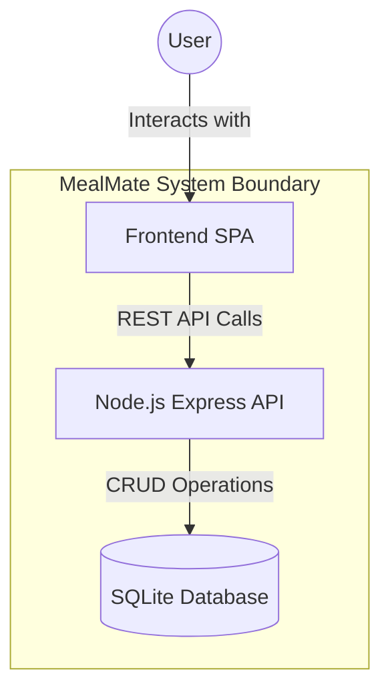
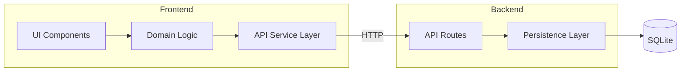
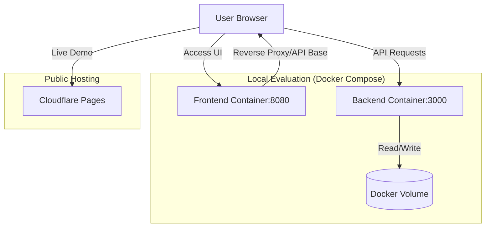

# Architecture Documentation: MealMate

## 1. System Context
MealMate is a full-stack web application designed for meal planning and grocery management. It follows a client-server model where the frontend SPA interacts with a RESTful backend API for persistent data storage in a SQLite database.

```mermaid
graph TD
    User((User))
    subgraph "MealMate System Boundary"
        Frontend[Frontend SPA]
        Backend[Node.js Express API]
        DB[(SQLite Database)]
    end

    User -->|Interacts with| Frontend
    Frontend -->|REST API Calls| Backend
    Backend -->|CRUD Operations| DB
```

## 2. Building-Block Decomposition
The system is decomposed into distinct layers for the frontend and backend:

### Frontend (Browser)
- **UI Components**: React components for Recipe Library, Planner, and Pantry.
- **Domain Logic**: Client-side logic for ingredient scaling, budget tracking, and list aggregation.
- **API Service Layer**: Centralized modules (via `fetch`) for communicating with the backend endpoints.

### Backend (Node.js/Express)
- **Route Layer**: Endpoint definitions for Recipes, Meal Plans, and Pantry inventory.
- **Persistence Layer**: Data access logic using `better-sqlite3`.
- **Database**: SQLite file-based storage for all persistent entity data.

```mermaid
graph LR
    subgraph Frontend
        UI[UI Components]
        Domain[Domain Logic]
        APIClient[API Service Layer]
    end

    subgraph Backend
        Routes[API Routes]
        DataLayer[Persistence Layer]
    end

    DB[(SQLite)]

    UI --> Domain
    Domain --> APIClient
    APIClient -->|HTTP| Routes
    Routes --> DataLayer
    DataLayer --> DB
```

## 3. Persistence Strategy
- **Primary Source of Truth**: All core data (Recipes, Pantry, Meal Plans, Prices) is persisted in the **SQLite database**.
- **Client Cache**: LocalStorage is utilized primarily for temporary UI state (e.g., active filters) and optimistic UI updates before synchronization with the server.

## 4. Deployment View
The application supports two primary deployment and evaluation modes:

### Cloudflare Pages (Production-style)
The frontend builds are deployed to Cloudflare Pages for public access and automated CI/CD.

### Docker Compose (Evaluation Setup)
For local testing and evaluation, a multi-container Docker setup provides a reproducible environment:
- **Frontend Container**: NGINX serving the production build on port `8080`.
- **Backend Container**: Node.js/Express server on port `3000`.
- **Persistent Volume**: Docker volume mapping `backend/data` to ensure SQLite data persists across container restarts.

```mermaid
graph TD
    UserDevice[User Browser]
    
    subgraph "Local Evaluation (Docker Compose)"
        NGINX[Frontend Container:8080]
        Express[Backend Container:3000]
        DataVol[(Docker Volume)]
    end

    subgraph "Public Hosting"
        CF[Cloudflare Pages]
    end

    UserDevice -->|Access UI| NGINX
    UserDevice -->|Live Demo| CF
    NGINX -->|Reverse Proxy/API Base| UserDevice
    UserDevice -->|API Requests| Express
    Express -->|Read/Write| DataVol
```

## 5. Implementation Evidence
- **API Endpoints**: The backend provides functional REST endpoints, such as `GET /api/recipes`, which serves the seeded recipe database.
- **Data Integrity**: Foreign key constraints and unique indexes are enforced at the database level to ensure relational integrity.

## 6. Detailed UML Diagrams
For class-level abstractions and sequence diagrams, please refer to the **[UML Diagrams](UML_DIAGRAMS.md)** document.

