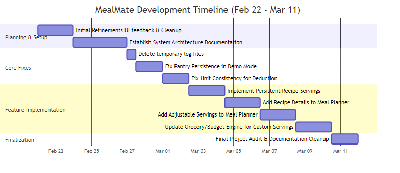

# Project Profile: MealMate

## 1. Project Objectives
MealMate aims to simplify the complex task of weekly meal planning and grocery management. The primary goal is to provide a high-performance, intuitive web application that helps users save time, reduce food waste, and adhere to a budget while managing their kitchen inventory.

## 2. Project Scope
### In-Scope (MVP)
- **User Authentication**: Secure JWT-based backend login and user registration via SQLite.
- **Recipe Library**: Curated recipes with dietary filters (Vegan, Vegetarian, Gluten-Free, High-Protein).
- **Weekly Planner**: Drag-and-drop or click-to-assign interface with **independent per-meal serving controls**.
- **Smart Grocery List**: Automatic aggregation of ingredients with real-time budget tracking.
- **Pantry Manager**: Inventory tracking with integration into the grocery list.
- **Serving Memory**: Persistent user preferences for recipe portions.
- **Responsive Design**: Optimization for desktop and mobile performance.

### Out-of-Scope (Future Enhancements)
- Shared shopping lists (Social features).
- Direct API integration with grocery retailers for price updates.

## 3. Target Group
- Busy professionals looking for quick meal organization.
- Individuals managing tight budgets.
- Individuals with specific dietary requirements.
- Home cooks wanting to organize their pantry and reduce waste.

## 4. Risks and Mitigation

Software projects face a range of risks across schedule, technical, integration, and documentation categories. For MealMate, risks were identified at project inception and monitored throughout development. Likelihood is rated Low (L), Medium (M), or High (H). Impact is rated Minor (1), Moderate (2), or Major (3). The Risk Score (L×I) indicates priority of mitigation effort.

| Risk-ID | Risk Description | Category | Likelihood | Impact | Score | Mitigation Applied |
| :--- | :--- | :--- | :--- | :--- | :--- | :--- |
| **R-01** | Scope creep — additional features added after implementation begins | Scope | M | 2 | 4 | Defined In-Scope / Out-of-Scope boundaries in this document before development started |
| **R-02** | Schedule overrun — single developer with limited weekly hours | Schedule | H | 3 | 9 | Fixed deadline enforced by Gantt milestones; lower-priority features (FR-7 Autocomplete) rated "Could" in MoSCoW to allow deferral |
| **R-03** | Integration defects — frontend and backend data contracts diverge | Integration | M | 3 | 6 | Shared JSON response shapes defined early; Postman collection used to validate API contract before frontend integration |
| **R-04** | Data persistence errors — SQLite UNIQUE constraint violations on seed re-runs | Persistence | M | 2 | 4 | Seed script updated to use `INSERT OR IGNORE`; `reset-db` script added for clean state |
| **R-05** | Deployment / configuration issues — Docker image fails to build on target OS | Deployment | L | 2 | 2 | Alpine-based multi-stage Dockerfile verified locally; Docker Compose tested for both dev and production configurations |
| **R-06** | Documentation inconsistency — diagrams do not match implemented architecture | Documentation | M | 2 | 4 | UML diagrams regenerated after each structural change; class diagram validated against actual SQLite migration files |
| **R-07** | Diagram notation errors — UML diagrams use non-standard notation | Documentation | H | 2 | 6 | Identified and corrected by migrating to PlantUML notation for use case and component diagrams |
| **R-08** | Testing gaps — test coverage insufficient to demonstrate requirement verification | Quality | M | 3 | 6 | Three-layer test strategy applied (unit, integration, manual); Test Case Catalogue created to make each test case traceable |
| **R-09** | Dependency issues — third-party npm package deprecation or breaking change | Technical | L | 2 | 2 | `package-lock.json` committed to lock exact dependency versions; `better-sqlite3` chosen for stability |
| **R-10** | Traceability gaps — requirements not linked to tests, making verification unclear | Documentation | M | 2 | 4 | Traceability Matrix expanded with Design Reference, Implementation Reference, and TC-prefixed Test Case IDs |

## 5. Project Plan

The MealMate project was executed over a focused three-week development period (22 February – 11 March 2026), organised into four sequential engineering phases: **Requirements & Architecture**, **Feature Implementation**, **Quality Assurance**, and **Documentation & Finalisation**. Each phase produced a defined deliverable that fed forward into the next phase. The project was further decomposed into six work packages (WP-01 through WP-06), each with a defined objective, activities, and a concrete deliverable, ensuring all functional and non-functional requirements were implemented and verified.

### Project Timeline (Gantt Chart)

### Work Package Breakdown

| WP-ID | Title | Phase | Dates | Objective | Key Activities | Deliverable |
| :--- | :--- | :--- | :--- | :--- | :--- | :--- |
| **WP-01** | Requirements & Architecture | Phase 1 | Feb 22–26 | Establish a verified, documented baseline of what the system must do and how it will be structured before any code is written. | Define all FR and NFR with MoSCoW priorities; identify risks and mitigations; design the system architecture (Node.js + React + SQLite + Docker); produce initial UML diagrams (Use Case, Component, Sequence, Class). | `docs/REQUIREMENTS.md`, `docs/ARCHITECTURE.md`, initial UML diagrams, Architecture Baseline milestone. |
| **WP-02** | User Authentication & Backend Foundation | Phase 2 | Feb 27–28 | Implement a secure, stateless authentication layer and establish the core backend infrastructure that all subsequent features depend on. | Implement JWT-based register/login endpoints in Express; configure SQLite database with `001_init.sql` migration; write seed data (`seed.js`); containerise the backend service in Docker; verify with Postman. | Working `/api/auth/register` and `/api/auth/login` endpoints; Docker backend container; Postman collection baseline. |
| **WP-03** | Recipe Library & Weekly Planner | Phase 2 | Mar 01–04 | Deliver the two core user-facing features that allow users to browse recipes and schedule them across a seven-day calendar. | Build the Recipe Library component with multi-tag dietary filters and text search (FR-1); implement serving-size scaling with localStorage persistence (FR-2); build the Weekly Planner with per-slot independent serving controls and backend persistence (FR-3); seed the database with 15+ recipes. | `RecipeLibrary.jsx`, `MealPlanner.jsx`, backend `/api/planner` endpoints, and persistent session data. |
| **WP-04** | Grocery, Pantry & Budget Engine | Phase 2 | Mar 05–07 | Implement the three data-driven features that transform the planned meals into actionable financial and shopping information. | Build the Smart Grocery aggregation engine with case-insensitive ingredient merging and unit-compatibility rules (FR-4); implement the Pantry Manager with partial-deduction algorithm (FR-6) and ingredient autocomplete (FR-7); build the Real-Time Budget Tracker with visual alerts (FR-5). | `GroceryList.jsx`, `PantryManager.jsx`, `BudgetTracker.jsx`, backend `/api/pantry` and `/api/grocery` endpoints; Feature Complete milestone. |
| **WP-05** | Quality Assurance & Testing | Phase 3 | Mar 05–10 | Systematically verify all functional requirements and non-functional targets through a three-layer test strategy. | Write backend integration tests using Jest (`api.test.js`); write frontend unit tests using Vitest; execute manual functional test cases across all FR scenarios (happy path, edge cases, persistence); run Postman Collection Runner for NFR audit (latency < 200 ms, 100 % pass rate, JSON schema validation). | `docs/Testing.md` (test report with results table), Postman test results, Vitest coverage report; QA Complete milestone. |
| **WP-06** | Documentation & Release | Phase 4 | Mar 08–11 | Produce the complete project documentation set and release the application in a deployment-ready state. | Compile the Testing report and Requirements Traceability Matrix (`TRACEABILITY_MATRIX.md`); regenerate and validate all UML diagrams; finalise `ARCHITECTURE.md` and `PROJECT_PROFILE.md`; write the `README.md` with setup, Docker, and deployment instructions; tag the final release on GitHub. | `docs/TRACEABILITY_MATRIX.md`, `docs/UML_DIAGRAMS.md`, finalised `README.md`, GitHub release tag. |

## 6. Project Organization
- **Development Model**: Agile (Iterative sprints).
- **Developer**: Omar
- **Tools**: GitHub (Version Control), Vitest (Unit Testing), Postman (API Testing), Docker (Containerization).
- **Implementation Proof**: [Application Screenshots](SCREENSHOTS.md)
