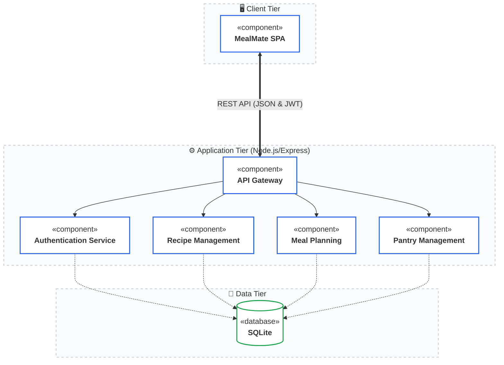
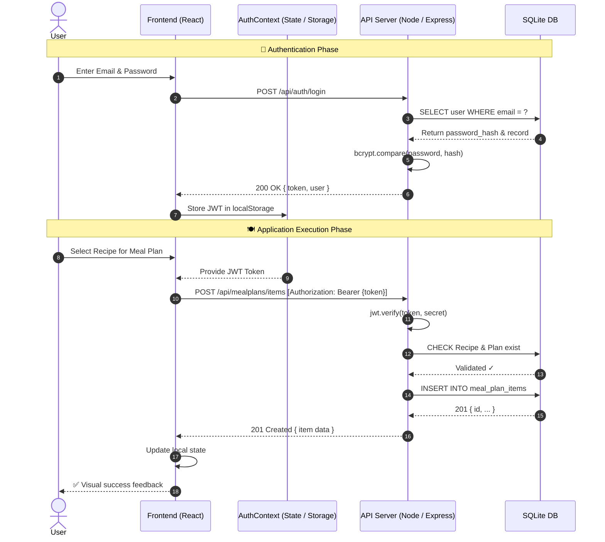
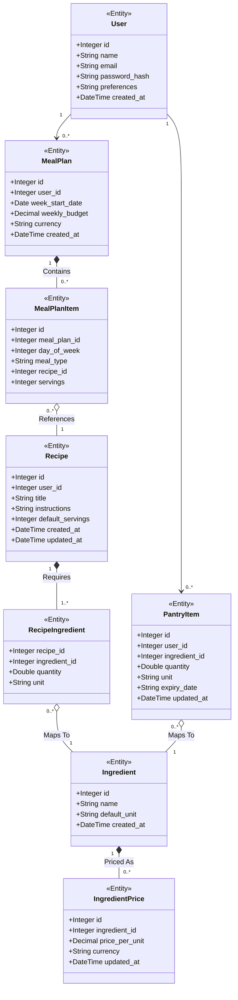

# MealMate — UML Diagrams

Visual representation of the MealMate system using standard UML notation, rendered with Mermaid.js.

---

## 1. Use Case Diagram

Illustrates the core interactions between the **User** and the MealMate system, including Authentication, Meal Planning, and Pantry management flows.

Illustrates the core interactions between the **User** and the MealMate system, including Authentication, Meal Planning, and Pantry management flows.

```mermaid
flowchart LR
    %% Perfect Oval Trick using HTML divs
    %% Green Style for Use Cases
    classDef usecase fill:none,stroke:none;
    %% Yellow Style for Extensions
    classDef extension fill:none,stroke:none;
    %% Actor Styles
    classDef guestActor fill:#388e3c,color:#fff,stroke:#2e7d32,stroke-width:2px;
    classDef authActor fill:#2e7d32,color:#fff,stroke:#1b5e20,stroke-width:2px;

    %% Actors
    Guest["👤<br/>Guest User"]:::guestActor
    Auth["👤<br/>Authenticated User"]:::authActor

    subgraph MealMate["MealMate System"]
        direction TB
        
        subgraph PublicArea["— Public Access —"]
            direction TB
            UC_Reg(["<div style='background:#e8f5e9; border:1px solid #81c784; border-radius:100%; padding:8px 25px; display:inline-block;'>Register Account</div>"]):::usecase
            UC_Log(["<div style='background:#e8f5e9; border:1px solid #81c784; border-radius:100%; padding:8px 25px; display:inline-block;'>Log In</div>"]):::usecase
            UC_Browse(["<div style='background:#e8f5e9; border:1px solid #81c784; border-radius:100%; padding:8px 25px; display:inline-block;'>Browse & Search Recipes</div>"]):::usecase
        end

        subgraph ExtensionArea["— Extensions —"]
            direction TB
            UC_Filter(["<div style='background:#fffde7; border:1px solid #ffd54f; border-radius:100%; padding:8px 25px; display:inline-block;'>Filter by Dietary Tags</div>"]):::extension
            UC_Scale(["<div style='background:#fffde7; border:1px solid #ffd54f; border-radius:100%; padding:8px 25px; display:inline-block;'>Adjust Serving Sizes</div>"]):::extension
        end

        subgraph AuthArea["— Authenticated Features —"]
            direction TB
            UC_Plan(["<div style='background:#e8f5e9; border:1px solid #81c784; border-radius:100%; padding:8px 25px; display:inline-block;'>Manage Weekly Meal Plan</div>"]):::usecase
            UC_List(["<div style='background:#e8f5e9; border:1px solid #81c784; border-radius:100%; padding:8px 25px; display:inline-block;'>Generate Grocery List</div>"]):::usecase
            UC_Pantry(["<div style='background:#e8f5e9; border:1px solid #81c784; border-radius:100%; padding:8px 25px; display:inline-block;'>Manage Pantry Inventory</div>"]):::usecase
            UC_Budget(["<div style='background:#e8f5e9; border:1px solid #81c784; border-radius:100%; padding:8px 25px; display:inline-block;'>Monitor Weekly Budget</div>"]):::usecase
        end
    end

    %% Guest Connections
    Guest --- UC_Reg
    Guest --- UC_Log
    Guest --- UC_Browse

    %% Authenticated Connections
    Auth --- UC_Browse
    Auth --- UC_Plan
    Auth --- UC_List
    Auth --- UC_Pantry
    Auth --- UC_Budget

    %% Relationships
    UC_Browse -.->|«extend»| UC_Filter
    UC_Browse -.->|«extend»| UC_Scale
    UC_List -.->|«include»| UC_Plan
    UC_List -.->|«include»| UC_Pantry

    %% Layout and Shape Refinements
    style MealMate fill:#fffef0,stroke:#fbc02d
    style PublicArea fill:none,stroke:#cfd8dc
    style ExtensionArea fill:none,stroke:#cfd8dc
    style AuthArea fill:none,stroke:#cfd8dc
```

> 💡 The **User** is the single actor who drives all interactions. **«include»** arrows show mandatory sub-flows (e.g. a Meal Plan always generates a Grocery List), while **«extend»** arrows show optional behaviour (e.g. Browse Recipes can be extended with Diet Tag filtering). All core features require the user to be authenticated via **Create Account / Login**.

---

## 2. Component Diagram

Shows the **Client-Server architecture**. The React frontend communicates with the Express backend via JWT-authenticated REST API calls, persisting data in SQLite.



> 💡 MealMate follows a classic **Client-Server** pattern. The **React + Vite** frontend runs entirely in the browser, managing state through an `AuthContext` that persists the JWT in `localStorage`. Every protected API call attaches the token as a `Bearer` header. The **Node.js / Express** backend exposes four REST route groups (`/auth`, `/recipes`, `/mealplans`, `/pantry`), all backed by a single **SQLite** file.

---

## 3. Sequence Diagram

Traces the complete flow from **User Login** (JWT acquisition) through to **adding a recipe** to the weekly meal plan using the authenticated session.



> 💡 The flow is split into two phases. In the **Authentication Phase** the frontend POSTs credentials, the server verifies the password hash with `bcrypt`, and returns a signed JWT that is stored in `localStorage`. In the **Application Execution Phase** the stored token is attached to subsequent requests; the server validates the signature with `jwt.verify()` before writing to the database, ensuring only authenticated users can modify meal plan data.

---

## 4. Class Diagram

Depicts the **data model** as stored in SQLite, including Authentication fields on `User`, `expiry_date` on `PantryItem`, and all entity relationships.



> 💡 Every **User** owns zero-or-more **MealPlan** and **PantryItem** records. A `MealPlan` is composed of `MealPlanItem` rows (one per meal slot), each referencing a **Recipe**. Recipes are built from `RecipeIngredient` join records that map to shared **Ingredient** entities — keeping ingredient names canonical. Each `Ingredient` has zero-or-more **IngredientPrice** entries used for budget calculation. `PantryItem` links a user's stock to the same `Ingredient` catalogue, and includes an `expiry_date` field for freshness tracking.
