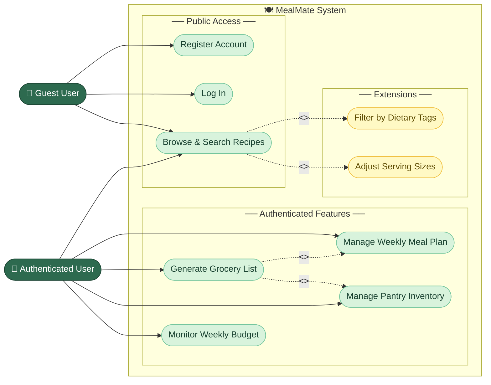
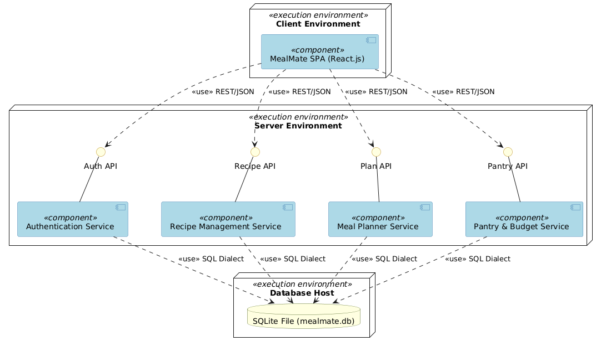
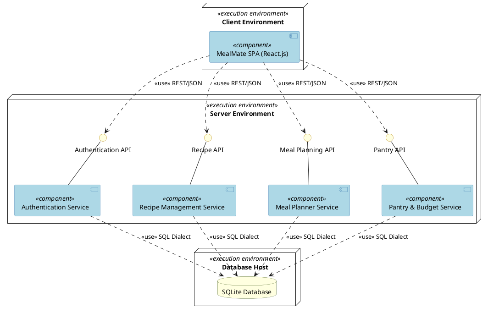
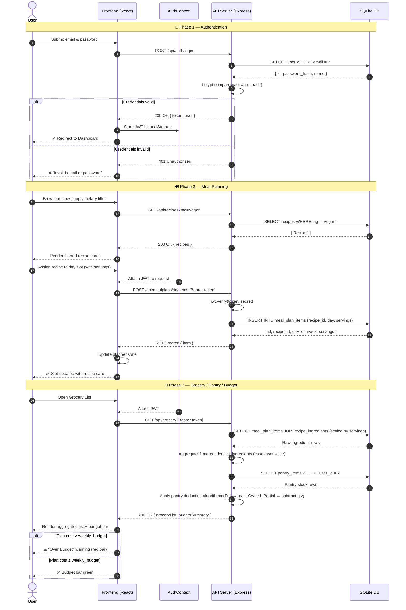
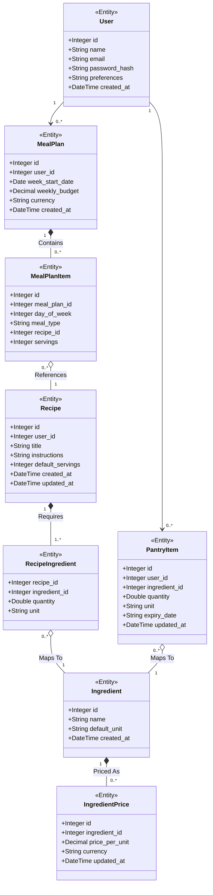

# MealMate — UML Diagrams

Visual representation of the MealMate system using standard UML notation, rendered with Mermaid.js.

---

## 1. Use Case Diagram

Illustrates the core interactions between the **User** and the MealMate system. A two-actor hierarchy separates **Guest User** (unauthenticated) from **Authenticated User** (logged in), with `<<include>>` and `<<extend>>` relationships shown on the relevant use cases.

> 💡 **Explanation:** Two actors model the privilege split: **Guest User** can register, log in, and freely browse recipes; **Authenticated User** gains access to all protected features. `<<extend>>` relationships show that dietary filtering and serving-size scaling are optional extensions to browsing. `<<include>>` relationships on **Generate Grocery List** express that it *always* depends on the Meal Plan and Pantry Inventory data — these are mandatory sub-flows, not optional ones.

---

## 2. Component Diagram

Shows the **Client-Server architecture**. The React frontend communicates with the Express backend via JWT-authenticated REST API calls, persisting data in SQLite.

> ⚠️ **UML Notation**: This diagram is specified in **PlantUML** utilizing the explicit `skinparam componentStyle uml2` configuration to comply rigidly with modern UML 2.0 component diagram standards, guaranteeing formal component icon rendering.

> 💡 **Explanation:** The component diagram illustrates the high-level structural decomposition of the MealMate system based on a strict multi-tier client-server pattern. The architectural computing load is distributed across discrete execution environments: the client environment hosts the compiled React.js SPA, the server environment hosts a modular monolithic backend, and the database host manages local persistent storage via SQLite. To ensure modular cohesion, interrelated lifecycle operations such as inventory tracking and cost analysis are purposefully encapsulated within a unified Pantry & Budget Service. Furthermore, the frontend acts as a strict consumer, resolving dependencies globally via tightly coupled but deeply abstracted JWT-authenticated RESTful interfaces (**Authentication, Recipe, Meal Planning, and Pantry APIs**).

---

## 3. Sequence Diagram

Traces three end-to-end flows: **Authentication**, **Meal Planning**, and **Grocery / Pantry / Budget Resolution**. Together these flows cover the full critical path of the MealMate application.

> 💡 **Phase 1** shows the full login flow including the server-side bcrypt check and the JWT storage in `localStorage`, plus the error branch for invalid credentials. **Phase 2** covers recipe filtering and the authenticated meal-plan write — showing the JWT verification guard before any DB write. **Phase 3** models the full grocery resolution pipeline: ingredient aggregation from the planner, pantry deduction, and the budget-alert conditional that drives the visual warning in the UI.

---

## 4. Class Diagram

Depicts the **data model** as stored in SQLite, including Authentication fields on `User`, `expiry_date` on `PantryItem`, and all entity relationships.

> 💡 Every **User** owns zero-or-more **MealPlan** and **PantryItem** records. A `MealPlan` is composed of `MealPlanItem` rows (one per meal slot), each referencing a **Recipe**. Recipes are built from `RecipeIngredient` join records that map to shared **Ingredient** entities — keeping ingredient names canonical. Each `Ingredient` has zero-or-more **IngredientPrice** entries used for budget calculation. `PantryItem` links a user's stock to the same `Ingredient` catalogue, and includes an `expiry_date` field for freshness tracking.
