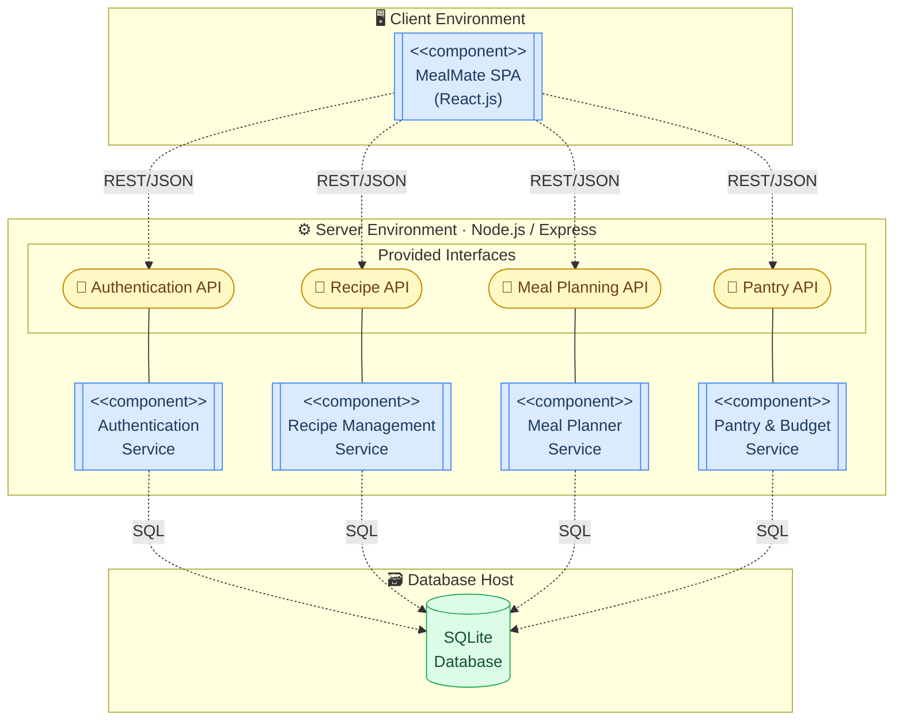
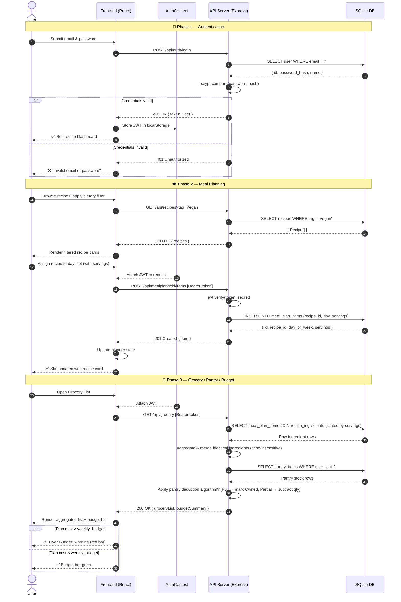
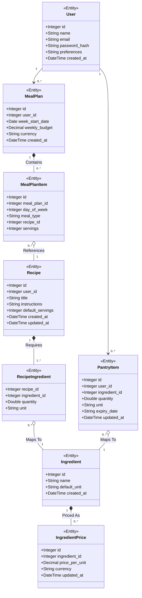

# MealMate — UML Diagrams

Visual representation of the MealMate system using standard UML notation, rendered with Mermaid.js.

---

## 1. Use Case Diagram

Illustrates core interactions between the **User** and the MealMate system.

> [!IMPORTANT]
> **UML Standard Compliance**: This diagram is rendered using **PlantUML** to ensure perfect mathematical ovals (ellipses) for all use cases, as strictly required by the project tutor.

> 💡 **Explanation:** Two actors model the privilege split: **Guest User** can register, log in, and freely browse recipes; **Authenticated User** gains access to all protected features. `<<extend>>` relationships show that dietary filtering and serving-size scaling are optional extensions to browsing. `<<include>>` relationships on **Generate Grocery List** express that it *always* depends on the Meal Plan and Pantry Inventory data — these are mandatory sub-flows, not optional ones.

---

## 2. Component Diagram

Shows the **Client-Server architecture**. The React frontend communicates with the Express backend via JWT-authenticated REST API calls, persisting data in SQLite.

> 💡 **Explanation:** The diagram models a three-tier client-server architecture across distinct execution environments. The **Client Environment** hosts the compiled React SPA. The **Server Environment** exposes four provided interfaces (shown as oval nodes) — each fulfilled by a dedicated `<<component>>` (shown with double-bordered subroutine boxes). The **Database Host** holds the SQLite database accessed by the server-side components via SQL. All client-to-server communication uses JWT-authenticated REST/JSON; server-to-database communication uses parameterised SQL queries via `better-sqlite3`. The **Pantry & Budget Service** is intentionally unified because pantry stock deduction and budget cost calculation share the same ingredient pricing data.

---

## 3. Sequence Diagram

Traces three end-to-end flows: **Authentication**, **Meal Planning**, and **Grocery / Pantry / Budget Resolution**. Together these flows cover the full critical path of the MealMate application.

> 💡 **Phase 1** shows the full login flow including the server-side bcrypt check and the JWT storage in `localStorage`, plus the error branch for invalid credentials. **Phase 2** covers recipe filtering and the authenticated meal-plan write — showing the JWT verification guard before any DB write. **Phase 3** models the full grocery resolution pipeline: ingredient aggregation from the planner, pantry deduction, and the budget-alert conditional that drives the visual warning in the UI.

---

## 4. Class Diagram

Depicts the **data model** as stored in SQLite, including Authentication fields on `User`, `expiry_date` on `PantryItem`, and all entity relationships.

> 💡 Every **User** owns zero-or-more **MealPlan** and **PantryItem** records. A `MealPlan` is composed of `MealPlanItem` rows (one per meal slot), each referencing a **Recipe**. Recipes are built from `RecipeIngredient` join records that map to shared **Ingredient** entities — keeping ingredient names canonical. Each `Ingredient` has zero-or-more **IngredientPrice** entries used for budget calculation. `PantryItem` links a user's stock to the same `Ingredient` catalogue, and includes an `expiry_date` field for freshness tracking.
