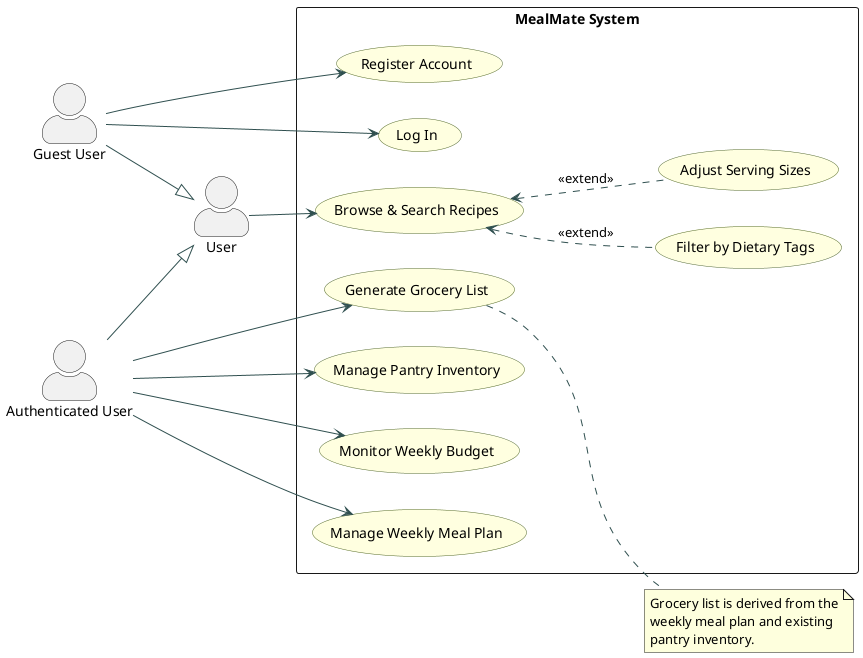
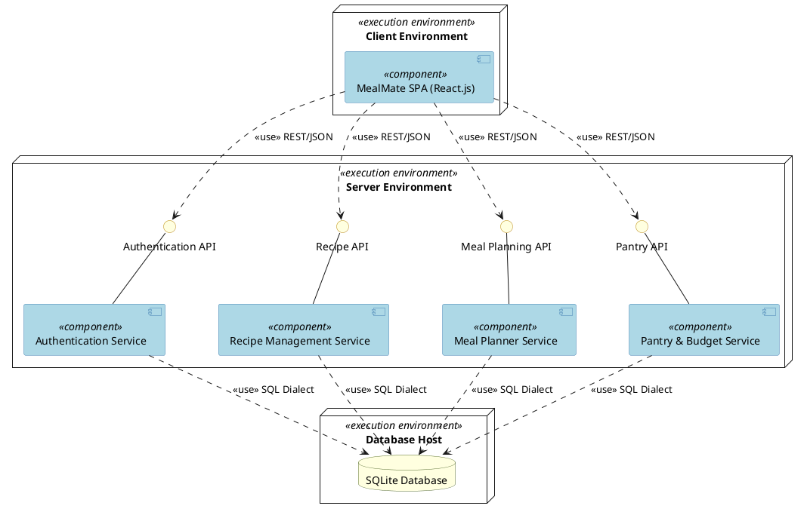
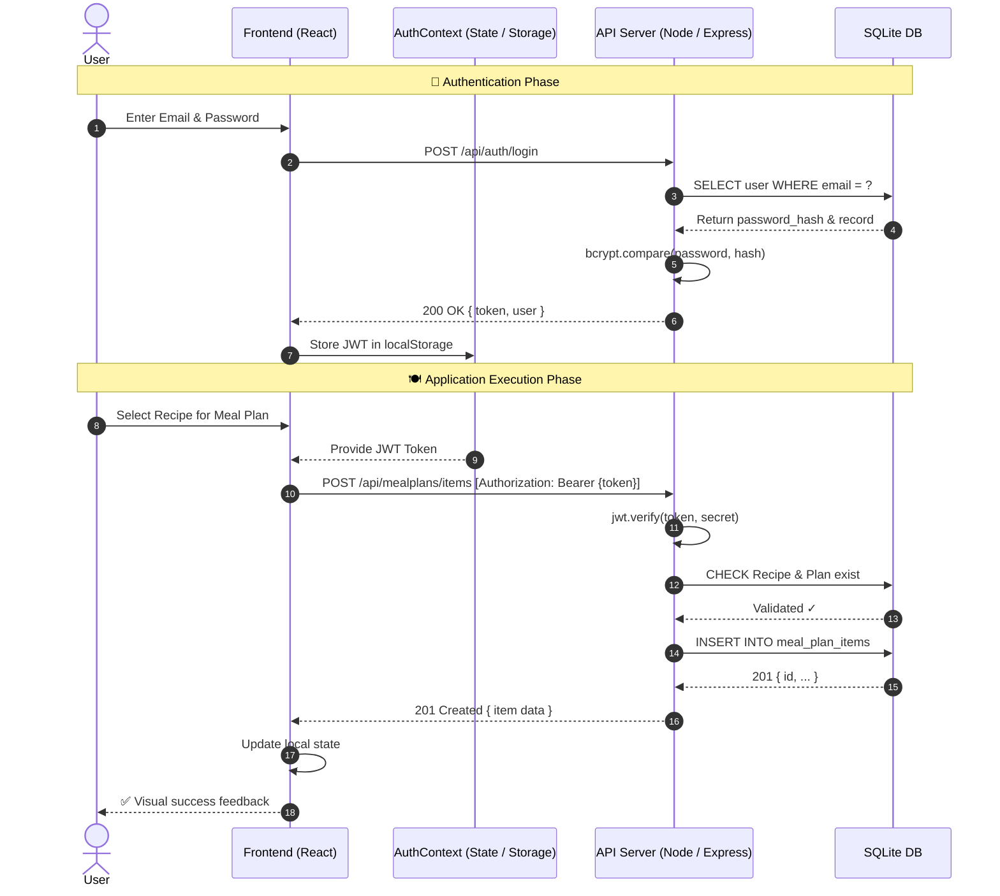
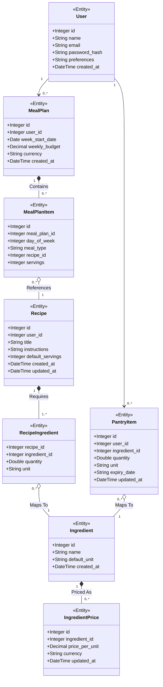

# MealMate — UML Diagrams

Visual representation of the MealMate system using standard UML notation, rendered with Mermaid.js.

---

## 1. Use Case Diagram

Illustrates the core interactions between the **User** and the MealMate system, including Authentication, Meal Planning, and Pantry management flows.

> ⚠️ **UML Notation**: This diagram is specified in **PlantUML** to comply with UML standards. Use cases are drawn as ovals, the actor is a stick figure, and `<<include>>`/`<<extend>>` stereotypes follow the UML specification. Render at [plantuml.com/plantuml](https://www.plantuml.com/plantuml/uml/) or any PlantUML-compatible tool.

---

## 2. Component Diagram

Shows the **Client-Server architecture**. The React frontend communicates with the Express backend via JWT-authenticated REST API calls, persisting data in SQLite.

> ⚠️ **UML Notation**: This diagram is specified in **PlantUML** to comply with UML Component Diagram standards. Components use the `[ComponentName]` notation (rectangle with the component symbol), provided interfaces are shown as `()` circles, and dependencies use `<<use>>` stereotypes. Render at [plantuml.com/plantuml](https://www.plantuml.com/plantuml/uml/).

> 💡 MealMate follows a classic **Client-Server** pattern. The **React + Vite** frontend runs entirely in the browser, managing state through an `AuthContext` that persists the JWT in `localStorage`. Every protected API call attaches the token as a `Bearer` header. The **Node.js / Express** backend exposes four REST route groups (`/auth`, `/recipes`, `/mealplans`, `/pantry`), all backed by a single **SQLite** file. A dedicated **JWT Middleware** component intercepts all protected requests at the gateway level.

---

## 3. Sequence Diagram

Traces the complete flow from **User Login** (JWT acquisition) through to **adding a recipe** to the weekly meal plan using the authenticated session.

> 💡 The flow is split into two phases. In the **Authentication Phase** the frontend POSTs credentials, the server verifies the password hash with `bcrypt`, and returns a signed JWT that is stored in `localStorage`. In the **Application Execution Phase** the stored token is attached to subsequent requests; the server validates the signature with `jwt.verify()` before writing to the database, ensuring only authenticated users can modify meal plan data.

---

## 4. Class Diagram

Depicts the **data model** as stored in SQLite, including Authentication fields on `User`, `expiry_date` on `PantryItem`, and all entity relationships.

> 💡 Every **User** owns zero-or-more **MealPlan** and **PantryItem** records. A `MealPlan` is composed of `MealPlanItem` rows (one per meal slot), each referencing a **Recipe**. Recipes are built from `RecipeIngredient` join records that map to shared **Ingredient** entities — keeping ingredient names canonical. Each `Ingredient` has zero-or-more **IngredientPrice** entries used for budget calculation. `PantryItem` links a user's stock to the same `Ingredient` catalogue, and includes an `expiry_date` field for freshness tracking.
