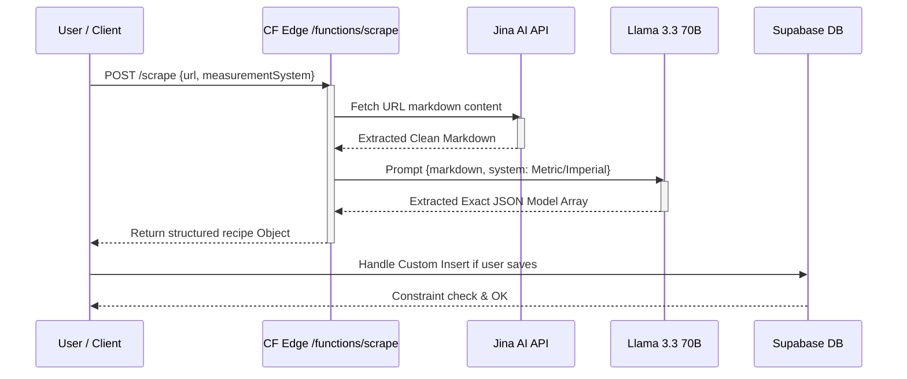
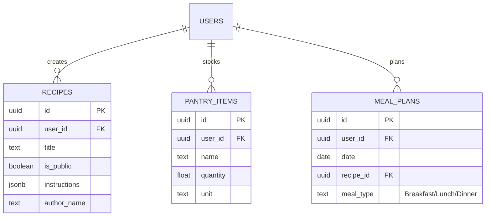

# MealMate — UML Diagrams

Visual representation of the MealMate system using standard UML notation, rendered directly with Mermaid.js.

---

## 1. Use Case Diagram

```mermaid
usecaseDiagram
    actor Guest
    actor AuthenticatedUser

    Guest --> (Browse Recipes)
    Guest --> (Register)
    Guest --> (Login)
    
    AuthenticatedUser --> (Browse Recipes)
    AuthenticatedUser --> (Share Recipe to Community)
    AuthenticatedUser --> (Use Llama 3 AI Chat)
    AuthenticatedUser --> (Scrape Live URL to Recipe)
    AuthenticatedUser --> (Manage Weekly Planner)
    AuthenticatedUser --> (Manage Pantry)

    (Browse Recipes) .-> (Filter Dietary Needs): <<extends>>
    (Manage Weekly Planner) ..> (Calculate Groceries & Budget): <<includes>>
```

> 💡 The use-case model distinguishes between **Guest** and **Authenticated** users. With our modern Supabase setup, AI Scraper integrations, and Cloudflare RLS rules, specific actions strictly lock down user identities prior to any execution.

---

## 2. Component Diagram

```mermaid
%%{init: {'theme': 'dark'}}%%
graph TD
    subgraph Frontend Client (React)
        RC[Recipe UI]
        PM[Planner / Pantry UI]
        AIUI[AI Modal Chat]
    end

    subgraph CDN & Global Edge (Cloudflare)
        CF[Cloudflare Pages Hosting]
        CFWorkers[Edge API Workers /functions]
    end

    subgraph LLM Intelligence Pipeline
        Llama[Cloudflare Workers AI Llama 3.3]
        Jina[Jina Reader Markdown API]
    end

    subgraph Persistence Layer (Supabase)
        SDB[(Postgres Database)]
        AuthServer[Supabase Auth Service]
    end

    RC --> CF
    PM --> CFWorkers
    AIUI --> CFWorkers

    CFWorkers --> AuthServer
    CFWorkers --> Llama
    CFWorkers -.->|URL Content Extraction| Jina
    CFWorkers --> SDB
```

> 💡 MealMate follows a heavily integrated Serverless API pattern. The React UI runs in-browser. Any heavy data manipulation runs instantaneously exactly at the Cloudflare Edge nodes, significantly optimizing loading times bypassing heavy monolithic backends.

---

## 3. Sequence Diagram (Intel Scraper & Supabase)



> 💡 In the **Intelligent Extraction Phase** the frontend POSTs a URL to the edge handler. The handler leverages modern Jina Reader to fetch un-obfuscated markdown, which is then explicitly prompted through a powerful Llama 70B instance to meticulously scrape, analyze culinary values into decimal metric equivalents, and finally map to a rigid JSON object for frontend presentation.

---

## 4. Class / ERD Diagram (Postgres Core Schema)



> 💡 The schema fundamentally stripped away pivot tables in favor of leveraging JSONB parsing and normalized edge constraints inside PostgreSQL. Every **User** acts as a distinct foreign key controlling explicit Row-Level Security ensuring user privacy and data separation on a shared global cloud backend.
